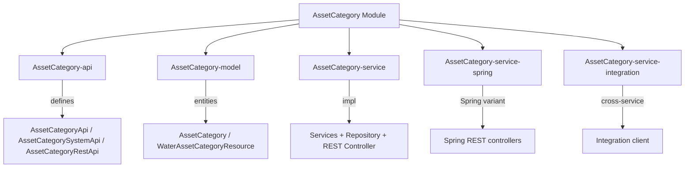
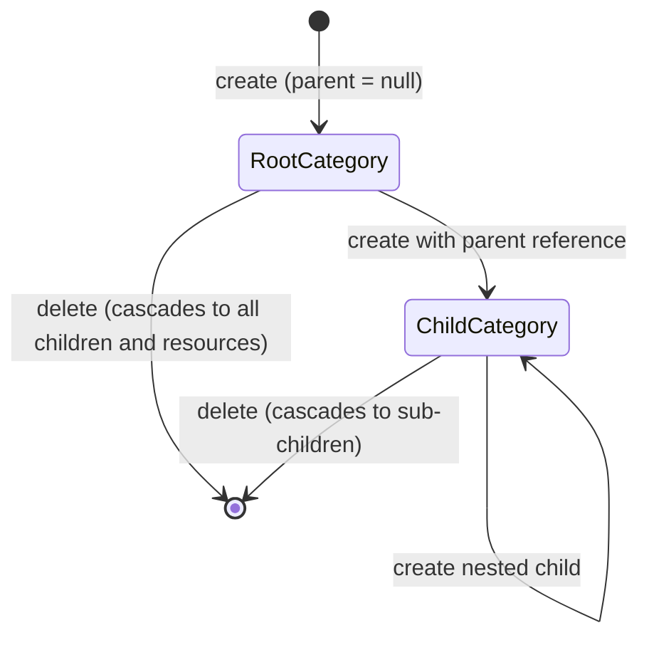

# AssetCategory Module

The **AssetCategory** module provides hierarchical category management for Water Framework resources. Any resource can be tagged with categories organized in a tree structure (parent/child). Categories support sharing with other users via the `SharedEntity` interface.

## Architecture Overview



## Sub-modules

| Sub-module | Description |
|---|---|
| **AssetCategory-api** | Defines `AssetCategoryApi`, `AssetCategorySystemApi`, `AssetCategoryRestApi`, and `AssetCategoryRepository` interfaces |
| **AssetCategory-model** | Contains `AssetCategory` and `WaterAssetCategoryResource` JPA entities |
| **AssetCategory-service** | Service implementations, repository, and REST controller |
| **AssetCategory-service-spring** | Spring MVC variant |
| **AssetCategory-service-integration** | Integration client for cross-service category resolution |

## AssetCategory Entity

```java
@Entity
@Table(uniqueConstraints = @UniqueConstraint(columnNames = {"name", "parent_id"}))
@AccessControl(availableActions = {CrudActions.class}, rolesPermissions = {...})
public class AssetCategory extends AbstractJpaExpandableEntity
    implements ProtectedEntity, SharedEntity { }
```

### Entity Fields

| Field | Type | Constraints | Description |
|---|---|---|---|
| `name` | String | `@NotEmpty`, `@NoMalitiusCode`, unique with `parent_id` | Category name |
| `ownerUserId` | Long | `@NonNull` | Owner user ID (auto-set from session) |
| `parent` | AssetCategory | Optional `@ManyToOne` | Parent category (`null` = root) |
| `innerAssets` | Set\<AssetCategory\> | `@OneToMany`, cascade delete | Child categories |
| `resources` | Set\<WaterAssetCategoryResource\> | `@OneToMany`, EAGER | Resources in this category |

## WaterAssetCategoryResource

Maps arbitrary resources to a category (join table):

| Field | Type | Description |
|---|---|---|
| `resourceName` | String | Fully-qualified class name of the resource |
| `resourceId` | long | Primary key of the resource instance |
| `category` | AssetCategory | The category this resource belongs to |

## Category Hierarchy



## API Interfaces

### AssetCategoryApi (Public — with permission checks)

Extends `BaseEntityApi<AssetCategory>`:

| Method | Description |
|---|---|
| `save(AssetCategory)` | Create a category |
| `update(AssetCategory)` | Update name, parent, or sharing settings |
| `find(long id)` | Find by ID |
| `findAll(delta, page, filter, order)` | Paginated list |
| `remove(long id)` | Delete category (cascades to children and resources) |

### AssetCategorySystemApi (System — no permission checks)

Same methods, callable from internal services without a logged-in user.

### REST Endpoints

| HTTP Method | Path | Auth | Description |
|---|---|---|---|
| `POST` | `/assetcategories` | `@LoggedIn` | Create category |
| `PUT` | `/assetcategories` | `@LoggedIn` | Update category |
| `GET` | `/assetcategories/{id}` | `@LoggedIn` | Find by ID |
| `GET` | `/assetcategories` | `@LoggedIn` | Find all (paginated) |
| `DELETE` | `/assetcategories/{id}` | `@LoggedIn` | Delete category |

## Default Roles

| Role | Permissions |
|---|---|
| **assetCategoryManager** | `save`, `update`, `find`, `find_all`, `remove` |
| **assetCategoryViewer** | `find`, `find_all` |
| **assetCategoryEditor** | `save`, `update`, `find`, `find_all` |

## Usage Example

```java
@Inject
private AssetCategoryApi assetCategoryApi;

// Create a root category
AssetCategory root = new AssetCategory();
root.setName("Sensors");
assetCategoryApi.save(root);

// Create a child category
AssetCategory child = new AssetCategory();
child.setName("Temperature");
child.setParent(root);
assetCategoryApi.save(child);

// Delete root — all children cascade-deleted automatically
assetCategoryApi.remove(root.getId());
```

## Dependencies

- **Core-api** — `BaseEntityApi`, `BaseEntitySystemApi`
- **Core-permission** — `@AccessControl`, `CrudActions`, `SharedEntity`
- **JpaRepository-api** — `AbstractJpaExpandableEntity`
- **Rest-api** — REST controller infrastructure, `@LoggedIn`
